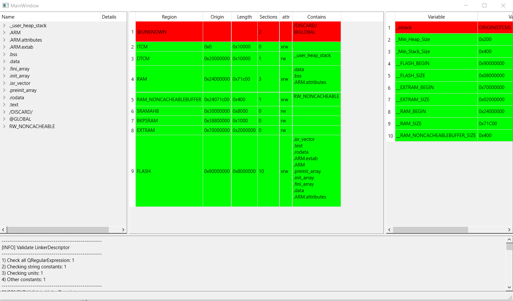

## Inspiration from this
1) [mapfile_parser on Rust & python](https://github.com/Decompollaborate/mapfile_parser)
2) [MapViewer C#](https://github.com/govind-mukundan/MapViewer)
3) [MCUViewer C++](https://github.com/klonyyy/MCUViewer)
4) [My Clang+Python test](https://github.com/shpegun60/ClangPythonTest)
5) [My Clang+Qt test](https://github.com/shpegun60/QtClangParser)
6) [GccMapVisualizer Js](https://github.com/jotux/GccMapVisualizer)


## Linker script is parsed:


## Last version
```
"  SystemCoreClock: 0x24000000 (0x4 bytes)"
"  SystemD2Clock: 0x24000004 (0x4 bytes)"
"  uwTickPrio: 0x24000008 (0x4 bytes)"
"  uwTickFreq: 0x2400000c (0x1 bytes)"
"  *fill*: 0x2400000d (0x3 bytes)"
"  _impure_ptr: 0x24000010 (0x4 bytes)"
"  _impure_data: 0x24000014 (0x4c bytes)"
"  __atexit_recursive_mutex: 0x24000060 (0x4 bytes)"
"  0x1c C:/ST/STM32CubeIDE_1.15.0/STM32CubeIDE/plugins/com.st.stm32cube.ide.mcu.externaltools.gnu-tools-for-stm32.13.3.rel1.win32_1.0.0.202411081344/tools/bin/../lib/gcc/arm-none-eabi/13.3.1/thumb/v7e-m+dp/hard/crtbegin.o: 0x24000068 (0x1c bytes)"
"  hfdcan1: 0x24000084 (0xa0 bytes)"
"  hfdcan2: 0x24000124 (0xa0 bytes)"
"  hfdcan3: 0x240001c4 (0xa0 bytes)"
"  .bss.HAL_RCC_FDCAN_CLK_ENABLED: 0x24000264 (0x4 bytes)"
"  hspi1: 0x24000268 (0x88 bytes)"
"  hspi2: 0x240002f0 (0x88 bytes)"
"  hspi4: 0x24000378 (0x88 bytes)"
"  hdma_spi1_rx: 0x24000400 (0x78 bytes)"
"  hdma_spi1_tx: 0x24000478 (0x78 bytes)"
"  hdma_spi2_rx: 0x240004f0 (0x78 bytes)"
"  hdma_spi2_tx: 0x24000568 (0x78 bytes)"
"  hdma_spi4_rx: 0x240005e0 (0x78 bytes)"
"  hdma_spi4_tx: 0x24000658 (0x78 bytes)"
"  .bss.__sbrk_heap_end: 0x240006d0 (0x4 bytes)"
"  htim2: 0x240006d4 (0x4c bytes)"
"  huart4: 0x24000720 (0x94 bytes)"
"  huart5: 0x240007b4 (0x94 bytes)"
"  huart7: 0x24000848 (0x94 bytes)"
"  huart3: 0x240008dc (0x94 bytes)"
"  hdma_uart4_rx: 0x24000970 (0x78 bytes)"
"  hdma_uart4_tx: 0x240009e8 (0x78 bytes)"
"  hdma_uart5_rx: 0x24000a60 (0x78 bytes)"
"  hdma_uart5_tx: 0x24000ad8 (0x78 bytes)"
"  hdma_uart7_rx: 0x24000b50 (0x78 bytes)"
"  hdma_uart7_tx: 0x24000bc8 (0x78 bytes)"
"  hdma_usart3_rx: 0x24000c40 (0x78 bytes)"
"  hdma_usart3_tx: 0x24000cb8 (0x78 bytes)"
"  uwTick: 0x24000d30 (0x4 bytes)"
"  SysTimer::m_timers: 0x24000d34 (0xc bytes)"
"  IRQGuard::irq_lock_count_: 0x24000d40 (0x4 bytes)"
"  SpiEngineBase::m_spies: 0x24000d44 (0xc bytes)"
"  Periph::instance()::instance: 0x24000d50 (0x1780 bytes)"
"  guard variable for Periph::instance()::instance: 0x240024d0 (0x4 bytes)"
"  perif_global: 0x240024d4 (0x4 bytes)"
"  guard variable for SysTimer::m_timers: 0x240024d8 (0x4 bytes)"
"  guard variable for SpiEngineBase::m_spies: 0x240024dc (0x4 bytes)"
"  App::instance()::instance: 0x240024e0 (0x210 bytes)"
"  guard variable for App::instance()::instance: 0x240026f0 (0x4 bytes)"
"  global: 0x240026f4 (0x4 bytes)"
"  buffers::sbuf::StaticQueue<an_packet_t*, 64u>::error_value_: 0x240026f8 (0x4 bytes)"
"  buffers::sbuf::StaticQueue<NanotecBase::Transaction, 16u>::error_value_: 0x240026fc (0x10 bytes)"
"  guard variable for buffers::sbuf::StaticQueue<NanotecBase::Transaction, 16u>::error_value_: 0x2400270c (0x4 bytes)"
"  .bss.g_irq_lock_ct: 0x24002710 (0x4 bytes)"
"  DwtTimer::_dwtInitialized: 0x24002714 (0x1 bytes)"
"  *fill*: 0x24002715 (0x3 bytes)"
"  LambdaTimer::m_lambdas: 0x24002718 (0xc bytes)"
"  guard variable for LambdaTimer::m_lambdas: 0x24002724 (0x4 bytes)"
"  .bss.m_instances: 0x24002728 (0x14 bytes)"
"  .bss.m_instance_counter: 0x2400273c (0x1 bytes)"
"  *fill*: 0x2400273d (0x3 bytes)"
"  .bss._ZN12_GLOBAL__N_113__new_handlerE: 0x24002740 (0x4 bytes)"
"  __malloc_sbrk_start: 0x24002744 (0x4 bytes)"
"  __malloc_free_list: 0x24002748 (0x4 bytes)"
"  __sf: 0x2400274c (0x138 bytes)"
"  errno: 0x24002884 (0x4 bytes)"
"  __lock___malloc_recursive_mutex: 0x24002888 (0x1 bytes)"
"  __lock___atexit_recursive_mutex: 0x24002889 (0x1 bytes)"
"  *fill*: 0x2400288a (0x2 bytes)"
"  __atexit0: 0x2400288c (0x8c bytes)"
"  __atexit: 0x24002918 (0x4 bytes)"
"  __bss_end__ = _ebss: 0x2400291c (0x4 bytes)"
"  0x6004 load address 0x0802a38c: 0x2400291c (0x6004 bytes)"
"  . = ALIGN (0x8): 0x24002920 (0x8 bytes)"
"  *fill*: 0x2400291c (0x4 bytes)"
"  PROVIDE (_end = .): 0x24002920 (0 bytes)"
"  . = (. + _Min_Heap_Size): 0x24004920 (0 bytes)"
"  *fill*: 0x24002920 (0x2000 bytes)"
"  . = (. + _Min_Stack_Size): 0x24008920 (0 bytes)"
"  *fill*: 0x24004920 (0x4000 bytes)"
"  . = ALIGN (0x8): 0x24008920 (0x8 bytes)"
"  0x2e: 0x0 (0x2e bytes)"
```
